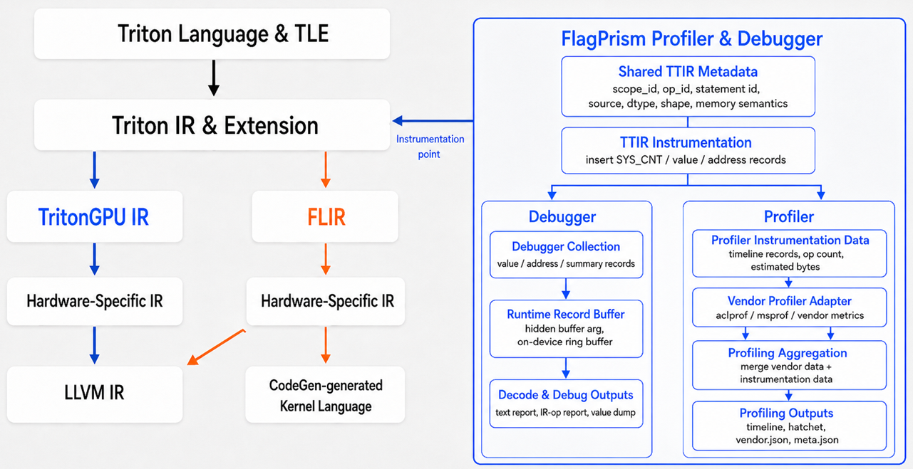

# FlagPrism

[English](README.md) | 简体中文

<p align="center">
  
</p>

FlagPrism 是面向 Triton 程序的多后端调试与性能分析工具，旨在为 NVIDIA GPU
及多种 AI 加速设备提供一致的观测工作流。作为
[FlagTree](https://github.com/flagos-ai/FlagTree) 生态的一部分，FlagPrism
能够在编译期和运行期观测 Triton kernel，将源码上下文、Triton IR 操作与设备
事件关联起来，并将采集的数据转化为报告，帮助开发者分析程序正确性、内存行为
以及不同加速器后端上的性能表现。

FlagPrism 包含两个面向用户的组件：

- **[Debugger](Debugger/README.md)** 采集 `@triton.jit` kernel 指定区域内的
  数值、数值摘要、访存地址摘要、完整张量数据，以及语句和 operation 元数据。
  配置方式、采集等级、报告格式、示例和当前限制请参阅 Debugger README。
- **[Profiler](Profiler/README.md)** 记录执行上下文、时间线、operation 数量、
  估算数据量、硬件指标和厂商性能分析数据，并将其聚合为调用树、时间线、
  Hatchet、元数据和厂商相关输出。API、采集模式、命令行工具、可视化方式及
  后端用法请参阅 Profiler README。

## 后端支持

下表展示 FlagPrism 的后端支持路线图，描述的是 Debugger 和 Profiler 的集成
状态，而不是相应 FlagTree 编译器后端的可用状态。我们正在快速推进 FlagPrism
对更多设备和加速器后端的支持。

| NVIDIA | 华为昇腾 | 平头哥 | 海光 | 摩尔线程 | 沐曦 | 天数智芯 | 燧原 |
|:--:|:--:|:--:|:--:|:--:|:--:|:--:|:--:|
| 进行中<br>目标：2026 年 9 月 | ✅ | — | — | 合并中 | 待启动<br>目标：2026 年 10 月 | ✅ | 进行中<br>目标：2026 年 9 月 |

## 与 FlagTree 的关系

[FlagTree](https://github.com/flagos-ai/FlagTree) 是面向 AI 加速器的统一多后端
编译器，使 Triton 程序能够在不同类型的 AI 加速设备上运行。FlagPrism 为
FlagTree 提供配套的观测工具，帮助开发者调试 kernel 正确性、分析运行行为、
定位性能瓶颈并优化 Triton workload。FlagPrism 以 `third_party/FlagPrism`
submodule 的形式集成并维护在 FlagTree 中。

## 架构设计

### 总体设计

FlagPrism 以在异构加速设备上提供统一观测体验为核心设计思想，将开发者希望
观测的内容与各后端采集信息的具体方式相分离，使 Debugger 和 Profiler 能够在
不同设备上提供一致的概念和工作流。整体设计强调对用户程序低侵入、调试与性能
分析能力复用、结果清晰可预期，以及对新加速器后端的渐进式支持。

### Debugger

Debugger 对 Triton kernel 中的指定区域进行观测，并将静态源码和 IR 元数据与
运行时数值及内存信息结合起来，帮助开发者通过语句级报告、operation 级报告和
张量数据文件检查数值结果、内存访问与 kernel 数据流。详细信息请参阅
[Debugger README](Debugger/README.md)。

### Profiler

Profiler 将程序上下文、kernel 事件、插桩数据和厂商性能指标结合起来，用于分析
Triton workload 在设备上的执行情况，并将采集结果关联、聚合为调用树、时间线和
可移植的性能报告。详细信息请参阅 [Profiler README](Profiler/README.md)。

## 与 FlagTree 联合开发

FlagPrism 与 FlagTree 统一开发和编译。首先下载 FlagTree、拉取 FlagPrism
submodule，然后在 FlagTree 仓库根目录编译完整项目：

```bash
git clone https://github.com/flagos-ai/FlagTree.git
cd FlagTree
git submodule update --init --recursive third_party/FlagPrism
python3 -m pip install . --no-build-isolation
```

## 仓库结构

```text
FlagPrism/
├── Debugger/                 # 编译器 pass、运行时、解码器和 Python API
├── Profiler/                 # Profiler dialect、运行时、适配器和 Python API
├── cmake/FlagPrism.cmake     # 统一 CMake 集成策略
├── python/flagprism_build.py # FlagTree wheel 与 Python package 集成
└── docs/                     # 架构和后端适配文档
```

## 许可证

FlagPrism 使用与 [FlagTree](https://github.com/flagos-ai/FlagTree/blob/main/LICENSE)
一致的 [MIT License](LICENSE)。
